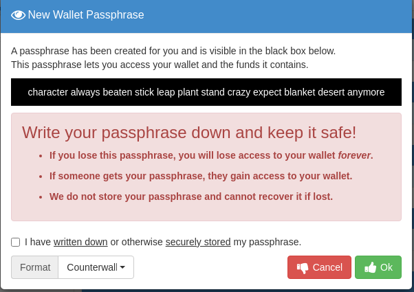
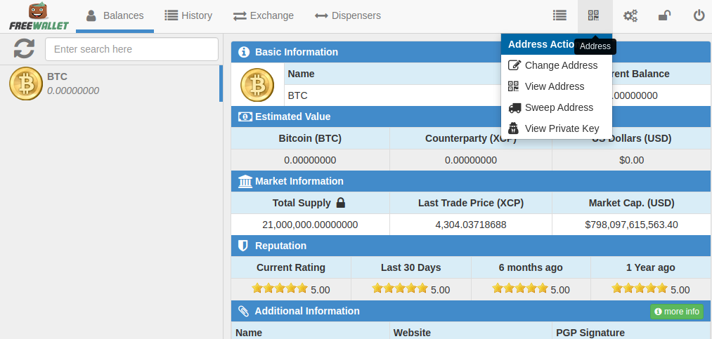
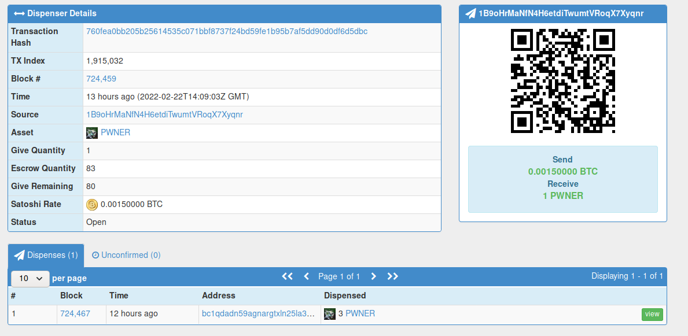

👋 Hi, I’m @pepeangle. This is just a quick steps showing how to buy rarepepes assets with Bitcoin (BTC) using Counterparty(XCP) wallets.

#### 1. Create Counterparty Wallet 
- Since **rarepepes** are assets on CounterParty (which is running on Bitcoin blockchain) we need to download a CounterParty wallet. I recommend  ([FreeWallet](https://freewallet.io)) since it support most platforms.
- Download & install wallet --> Open Wallet --> Click on `Create New Wallet`. The wallet should show you passphrase of 12 words. You must write this down on the paper and **keep it as secrets for yourself**.

#### 2. Send BTC to your Counterparty Wallet
- Since Counterparty using Bitcoin blockchain, your BTC addresses in your wallet is also XCP addresses as well as other XCP assets like rarepepe.
- You can view your wallet by click on QR code icon on top right corner

- Now you can copy this address and send your BTC to this address.  Your BTC balance should be shown after network confirmation.
  
#### 3. Buying rarepepe from your Counterparty Wallet using Dispenser.
- Suppose you want to buy rarepepe named`PWNER`, first you can checkout information about it at `https://xchain.io/asset/PWNER` 
- Click on `Dispenser` tab to see list of`PWNER`'s dispenser. 
- You can check out each dispenser by clicking on `view`. Following image show the 80 `PWNER` sell remaining at 0.0015 BTC each.

- If you want to buy 2 PWNER, you need to send your 0.003 BTC (0.0015x2) from your Counterparty wallet  to the dispenser address in this case `1B9oHrMaNfN4H6etdiTwumtVRoqX7Xyqnr`
- You should receive your `PWNER` shortly after network confirmation.
